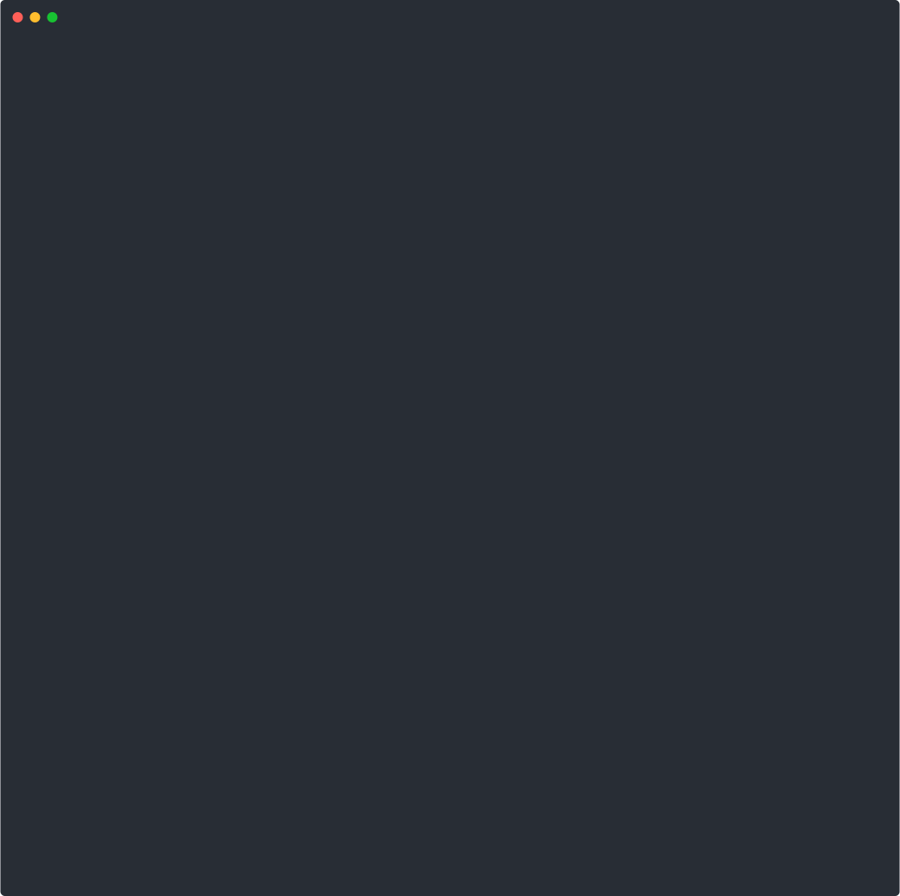

# ripctx

**Build the smallest safe context bundle for an AI code edit, ready to paste into ChatGPT or Claude.**

<p align="center">
  
</p>

ripctx analyzes your codebase and generates a token-budgeted context bundle — the minimum set of code an AI agent needs to safely modify a file or symbol. No more manually copying files. No more hallucinations from missing context.

If this helps you, a star would mean a lot :)

## The Problem

AI coding tools hallucinate when they lack context. You paste one file, the AI changes it, and breaks three callers it never saw. You could dump the whole repo, but that wastes tokens and money.

**ripctx solves this.** Point it at a file or symbol, set your token budget, and get back the smallest dependency-preserving context bundle — callers, callees, types, imports, tests — ranked by relevance and packed to fit.

## Install

```bash
npm install -g ripctx
```

Or use directly:

```bash
npx ripctx src/auth/login.ts
```

## Usage

```bash
# Bundle context for a file
ripctx src/auth/login.ts

# Bundle context for a specific symbol
ripctx --symbol refreshSession

# Set token budget (default: 12000)
ripctx src/api/routes.ts --budget 8000

# JSON output (for piping to other tools)
ripctx --symbol handleAuth --format json

# Disambiguate symbol location
ripctx --symbol validate --file src/utils/auth.ts
```

## What You Get

```
# ripctx — Context Bundle

| Field | Value |
|-------|-------|
| **Target** | `src/auth/login.ts` → `refreshSession` |
| **Tokens** | 4,231 / 12,000 |
| **Files** | 8 included, 3 omitted |

## Why included

| # | File | Symbol | Score | Reason | Tokens |
|---|------|--------|-------|--------|--------|
| 0 | `src/auth/login.ts` | `refreshSession` | 100 | Target symbol | 571 |
| 1 | `src/auth/types.ts` | `AuthToken` | 60 | Referenced by target | 42 |
| 2 | `src/api/client.ts` | `fetchWithRetry` | 60 | Referenced by target | 230 |
| 3 | `src/auth/login.test.ts` | — | 30 | Test file for target | 380 |

## Bundle
[fenced code blocks with each snippet...]

## Omitted (budget exceeded)
- `src/middleware/cors.ts` — 890 tokens, score 20
```

## How It Works

1. **Parse** — Extracts imports, exports, and symbol definitions from your codebase (TypeScript/JS and Python)
2. **Graph** — Builds a 1-hop dependency graph: what the target uses, and what uses the target
3. **Rank** — Scores each dependency by relevance:
   - `100` — Target file/symbol
   - `60` — Referenced type/symbol definitions
   - `45` — Direct imports used by target
   - `35` — Direct importers/callers
   - `30` — Related test files
   - `20` — Barrel/re-export files
   - `+10` — Files modified in working tree
4. **Pack** — Greedy knapsack packing into your token budget, extracting snippets not whole files
5. **Output** — Clean Markdown (or JSON) ready to paste into any AI chat

## Supported Languages

- TypeScript / JavaScript (`.ts`, `.tsx`, `.js`, `.jsx`, `.mjs`, `.cjs`)
- Python (`.py`, `.pyi`)

## Options

| Flag | Short | Default | Description |
|------|-------|---------|-------------|
| `--symbol` | `-s` | — | Target symbol name |
| `--file` | `-f` | — | File to search for symbol in |
| `--budget` | `-b` | `12000` | Max token budget |
| `--format` | — | `md` | Output format: `md` or `json` |
| `--root` | — | auto | Project root directory |
| `--help` | `-h` | — | Show help |
| `--version` | `-v` | — | Show version |

## Philosophy

- **Smallest sufficient context** — not a repo dump, not a file dump. The minimum code an AI needs to edit safely.
- **Budget-aware** — every token counts. ripctx packs greedily by relevance score within your budget.
- **Best-effort static analysis** — fast regex-based parsing, not a full compiler. Good enough for context gathering, not a type checker.
- **Zero config** — point it at a file and go. Auto-detects project root, language, and imports.

## Contributing

PRs welcome. The codebase is small and intentionally simple.

```bash
git clone https://github.com/Boyan253/ripctx.git
cd ripctx
npm install
npm run build
node dist/index.js src/analyzer.ts
```

## License

MIT
